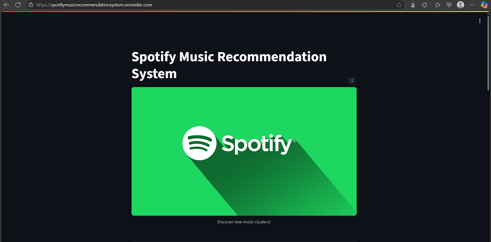
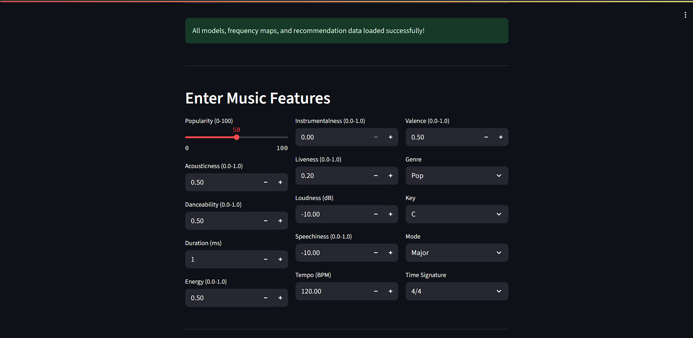
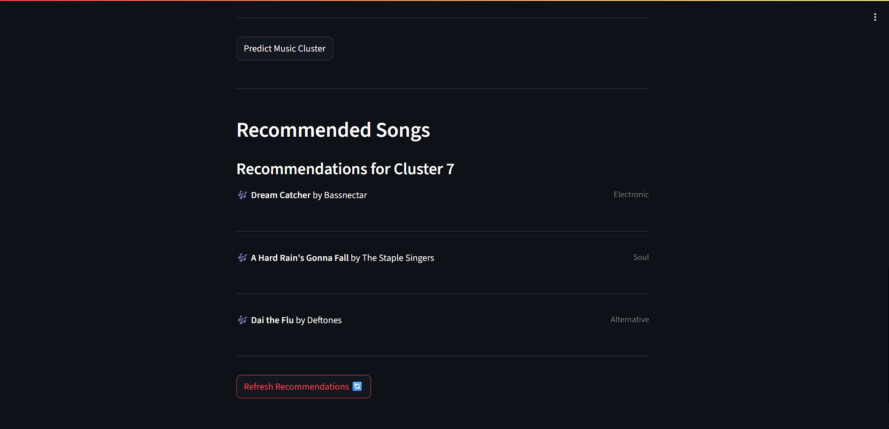

# Spotify Music Recommendation System

This project implements a music recommendation system that leverages machine learning to categorize songs based on their audio features and then recommends similar tracks from a curated dataset. The system is deployed as an interactive web application using Streamlit.

## ✨ Live Demo

Experience the Spotify Music Recommendation System live on Render:
[https://spotifymusicrecommendationsystem.onrender.com/](https://spotifymusicrecommendationsystem.onrender.com/)

## WebApp Screenshot




## 🚀 How It Works

The recommendation system follows a typical machine learning pipeline for unsupervised learning:

1.  **Data Preprocessing**:
    * **Frequency Encoding**: Categorical features (like `genre`, `key`, `mode`, `time_signature`) are converted into numerical representations based on their frequency of occurrence in the training data.
    * **Scaling**: Numerical audio features (`popularity`, `acousticness`, `danceability`, etc.) are scaled to standardize their range, preventing features with larger values from dominating the analysis.

2.  **Dimensionality Reduction (PCA)**:
    * Principal Component Analysis (PCA) is applied to the preprocessed data. This technique reduces the number of features while retaining most of the important variance, making the data more manageable for clustering and potentially improving model performance.

3.  **Clustering (K-Means)**:
    * The reduced-dimension data is then clustered using the K-Means algorithm. This groups songs with similar underlying characteristics into distinct clusters. The optimal number of clusters was determined using evaluation metrics like the Davies-Bouldin score.

4.  **Recommendation Logic**:
    * When a user inputs a song's features into the Streamlit application, the system first predicts which cluster that song belongs to using the trained PCA and K-Means models.
    * It then fetches a random selection of songs from a `Recommendation.csv` dataset that belong to the *same predicted cluster*.

## 🛠️ Technologies Used

* **Python**: The core programming language.
* **Streamlit**: For building the interactive web application.
* **Pandas**: For data manipulation and analysis.
* **Scikit-learn**: For machine learning algorithms (StandardScaler, PCA, KMeans).
* **Pickle**: For saving and loading trained machine learning models and data preprocessing components.

## 📁 Project Structure

The project directory should be structured as follows:

```bash
SpotifyMusicRecommendationSystem/
├── app.py
├── image.jpg
├── Recommendation.csv
└── models/
  ├── scaler_model.pkl
  ├── pca_model.pkl
  ├── kmeans_model.pkl
  ├── genre_freq_map.pkl
  ├── key_freq_map.pkl
  ├── mode_freq_map.pkl
  └── time_signature_freq_map.pkl
```


## ⚙️ Local Setup and Run

To set up and run this project on your local machine, follow these steps:

### 1. Clone the Repository

```
git clone [https://github.com/AST119/SpotifyMusicRecommendationSystem.git](https://github.com/AST119/SpotifyMusicRecommendationSystem.git)
cd SpotifyMusicRecommendationSystem
```
### 2. Create a Virtual Environment (Recommended)
```
python -m venv venv
# On Windows:
.\venv\Scripts\activate
# On macOS/Linux:
source venv/bin/activate
```
### 3. Install Dependencies
```
pip install -r requirements.txt
```
If you don't have a requirements.txt file, you can create one with the following content:
- streamlit
- pandas
- numpy
Then run pip install -r requirements.txt.

### 4. Prepare Models and Data
Crucially, you need to train your models and generate the frequency maps as described in the "How It Works" section (step 1, 2, 3) using your original Spotify dataset. Ensure these .pkl files are saved into a sub-directory named models/ within your project root, and Recommendation.csv is in the project root alongside app.py.

The files you need in the models/ directory are:

. scaler_model.pkl

. pca_model.pkl

. kmeans_model.pkl

. genre_freq_map.pkl

. key_freq_map.pkl

. mode_freq_map.pkl

. time_signature_freq_map.pkl

. The file you need in the project root (SpotifyMusicRecommendationSystem/) is:

. Recommendation.csv (Your dataset for recommendations).

### 5. Run the Streamlit Application
Once all files are in place, run the application from your terminal:

```
streamlit run app.py
```
This command will open the Streamlit application in your default web browser.

🤝 Contribution
Feel free to fork the repository, open issues, or submit pull requests to improve the project!
